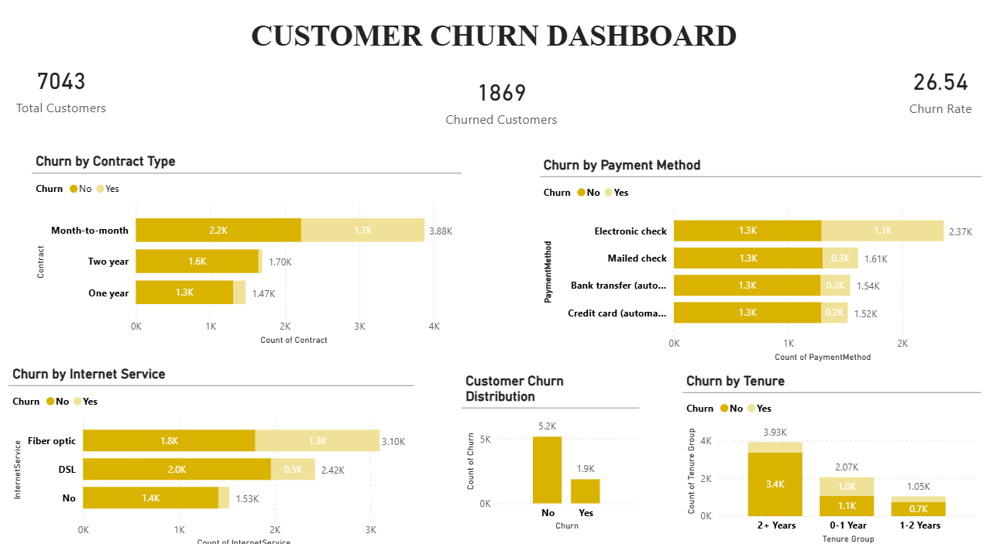

# 📊 Customer Churn Prediction Dashboard

## 📌 Project Overview
This project analyzes customer data to understand patterns and predict customer churn.  
It combines Python (EDA), SQL (analysis), and Power BI (dashboard) to generate insights and visualize customer behavior.

---

## 🛠️ Tools Used
- Python (Pandas, NumPy, Matplotlib, Seaborn)
- SQL
- Power BI

---

## 📁 Files Included
- customer_churn_prediction.ipynb → Data analysis using Python
- churn_analysis.sql → SQL queries
- churn_dashboard1.pbix → Power BI dashboard
- churn.csv → Dataset
- churn_dashboard.png → Dashboard preview

---

## 📊 Key Insights
- Customers with month-to-month contracts have higher churn
- Low tenure customers are more likely to leave
- Electronic check users show higher churn rates
- Higher monthly charges lead to increased churn

---

## 📈 Dashboard Preview

---

## ▶️ How to Run
- Open .ipynb file in Jupyter Notebook
- Run SQL queries in any SQL environment
- Open .pbix file in Power BI Desktop

---

## 👩‍💻 Author
Surabhi Singh
